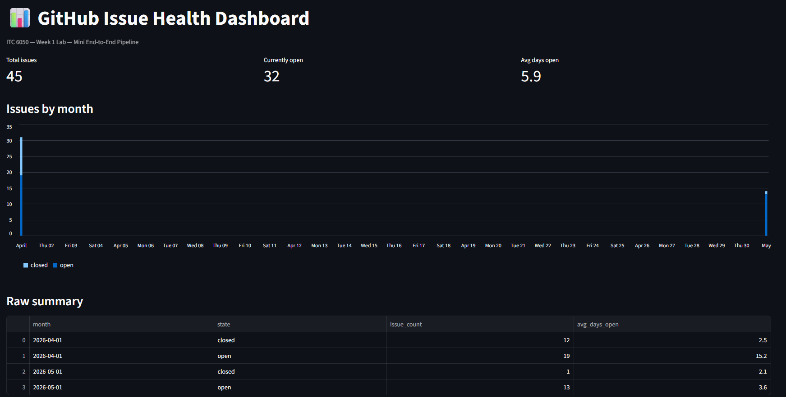

" ITC 6050 - Week 1 Lab" 

We run Postgres in Docker instead of installing it directly because Docker containers are portable, isolated, and reproducible — ensuring the same environment works identically on every machine without conflicts with local system settings.

What did dlt do for us?

Schema inference — automatically detected column types from the JSON response without us defining them manually.
Pagination handling — we only wrote the loop; dlt managed state and incremental loading.
Database loading — wrote the data directly to Postgres without us writing a single INSERT or SQLAlchemy model.

dlt handled JSON arrays (like labels) by storing them as JSONB columns in Postgres, preserving the nested structure without flattening it manually.

We built stg_github_issues as a separate model first so that multiple analysts can build different summaries on top of the same clean, consistent base layer — instead of each one writing their own version of the same cleanup logic.

## Dashboard Screenshot

